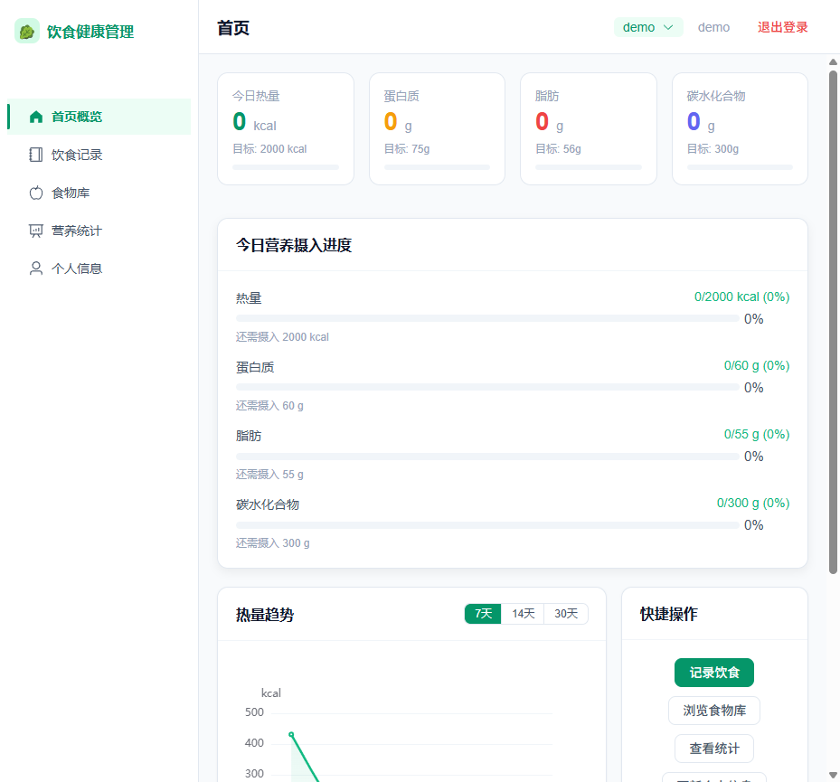
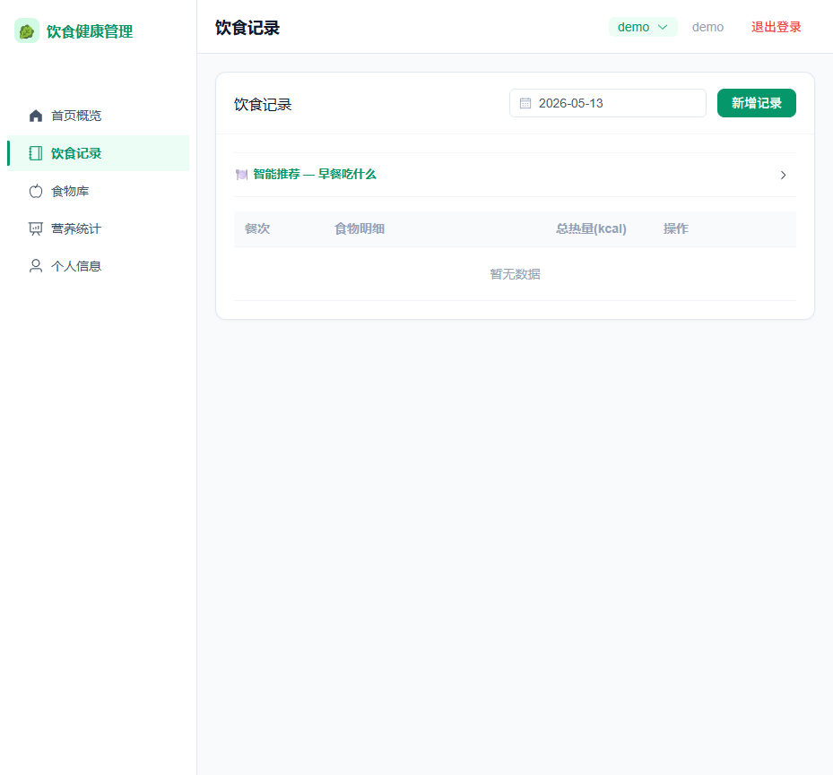
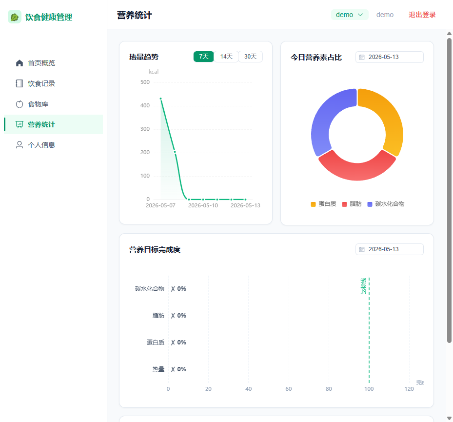

# 智能饮食健康管理平台

> 基于 Spring Boot + Vue 3 的家庭饮食健康管理系统，支持饮食记录、营养统计、智能推荐、运动记录、饮水记录、体重管理和家庭成员管理。

## 系统预览

| 登录页 | 首页 |
|:------:|:----:|
|  |  |

| 饮食记录 | 营养统计 |
|:--------:|:--------:|
|  |  |

## 技术栈

| 层级 | 技术 | 版本 | 说明 |
|------|------|------|------|
| 前端框架 | Vue 3 | 3.4 | Composition API + `<script setup>` |
| 构建工具 | Vite | 5.1 | 快速 HMR 开发体验 |
| UI 组件库 | Element Plus | 2.5 | 按需导入，中文友好 |
| 状态管理 | Pinia | 2.1 | 轻量级，支持 Composition API |
| 数据可视化 | ECharts | 5.5 | 折线图、柱状图、饼图 |
| 后端框架 | Spring Boot | 2.7 | 自动配置，快速开发 |
| ORM 框架 | MyBatis-Plus | 3.5 | 通用 CRUD + LambdaQueryWrapper |
| 安全框架 | Spring Security | 5.7 | JWT httpOnly Cookie 认证 |
| 数据库 | MySQL | 8.0 | 关系型数据库 |
| 容器化 | Docker Compose | 3.8 | 一键部署三服务 |

## 快速启动

### 方式一：本地开发

**前置要求：** JDK 11+、Maven 3.6+、Node.js 18+、MySQL 8.0

```bash
# 1. 创建数据库并导入数据
mysql -u root -p < sql/init.sql
mysql -u root -p diet_health < sql/food_expand.sql

# 2. 启动后端（默认端口 8082）
cd diet-health-backend
mvn spring-boot:run

# 3. 启动前端（默认端口 5173）
cd diet-health-frontend
npm install
npm run dev
```

- 后端 API：http://localhost:8082/api
- 前端页面：http://localhost:5173

### 方式二：Docker 一键部署

**前置要求：** Docker + Docker Compose

```bash
# 可选：设置 JWT 密钥（生产环境必须）
export JWT_SECRET=$(openssl rand -base64 32)

# 启动所有服务
docker-compose up -d
```

| 服务 | 地址 | 说明 |
|------|------|------|
| 前端 | http://localhost | Nginx 静态文件 + API 反向代理 |
| 后端 | http://localhost:8082 | Spring Boot REST API |
| 数据库 | localhost:3306 | MySQL 8.0 |

## 测试账号

| 角色 | 用户名 | 密码 | 权限 |
|------|--------|------|------|
| 管理员 | admin | admin123 | 用户管理 + 食物管理 + 全部功能 |
| 普通用户 | 注册即可 | — | 饮食记录 + 统计 + 推荐 + 家庭成员 |

## 功能概览

### 核心功能（13 个模块）

| 模块 | 功能 | 说明 |
|------|------|------|
| 用户认证 | 注册/登录/退出/Token刷新 | JWT httpOnly Cookie，SameSite=Lax 防 CSRF |
| 饮食记录 | 按日期、餐次记录食物 | 搜索支持拼音首字母，自动计算热量 |
| 食物库 | 浏览 230+ 种食物 | 按分类筛选，支持收藏 |
| 营养统计 | 日/周/月趋势图表 | 热量折线图、营养素饼图、目标完成度柱状图 |
| 智能推荐 | 基于多维度加权评分 | 营养适配度30% + 餐次适配25% + 健康度20% + 偏好15% + 收藏5% + 多样性5% |
| 饮食建议 | 每日建议/饮食分析/健康建议 | 状态判断 + 营养缺口 + 个性化建议 |
| 家庭成员 | 一个账号管理多人数据 | member_id 字段隔离，最多 10 人 |
| 饮水记录 | 记录每日饮水量 | 快捷添加，本周趋势图 |
| 运动记录 | 记录运动类型/时长/消耗 | 基于 MET 值自动计算热量消耗 |
| 体重记录 | 记录体重和体脂率 | 双 Y 轴趋势图，BMI 参考 |
| 健康目标 | 设定和追踪健康目标 | 目标体重/热量/营养素，进度跟踪 |
| 身体症状 | 记录身体不适症状 | 按类型统计，严重程度分析 |
| 管理后台 | 用户管理/食物管理/仪表盘 | 仅管理员角色可用 |

### 安全特性

- 密码 BCrypt 加密存储
- JWT Token 存 httpOnly Cookie（JavaScript 不可读）
- 登录限流 5 次/分钟，注册限流 3 次/2 分钟
- 角色权限控制（USER / ADMIN）
- 饮食记录归属校验（只能操作自己的数据）
- 全局异常处理（不泄露内部信息）
- 审计日志（@AuditLog 注解 + AOP 切面）
- 慢请求监控（>1 秒告警）
- 安全响应头（X-Frame-Options / CSP / XSS-Protection / HSTS）

## 项目结构

```
├── diet-health-backend/                 # Spring Boot 后端
│   ├── src/main/java/com/diet/
│   │   ├── controller/                  # REST 接口（13 个 Controller）
│   │   ├── service/                     # 业务逻辑（12 个 Service）
│   │   │   └── impl/                    # Service 实现类
│   │   ├── mapper/                      # MyBatis-Plus Mapper 接口（11 个）
│   │   ├── entity/                      # 数据库实体（11 个）
│   │   ├── dto/                         # 请求/响应 DTO（13 个）
│   │   ├── config/                      # Spring 配置类
│   │   ├── common/                      # 工具类、常量、异常处理
│   │   └── util/                        # JWT 工具
│   └── src/test/                        # JUnit 5 + Mockito 测试（49 个用例）
├── diet-health-frontend/                # Vue 3 前端
│   └── src/
│       ├── api/                         # API 调用函数（15 个模块）
│       ├── views/                       # 页面组件（14 个）
│       ├── components/                  # 可复用组件
│       ├── stores/                      # Pinia 状态管理（3 个 Store）
│       ├── router/                      # Vue Router 路由配置
│       ├── composables/                 # 组合式函数（3 个）
│       ├── utils/                       # 工具函数（日期/营养/拼音/常量）
│       └── styles/                      # 全局样式
├── sql/                                 # 数据库脚本
│   ├── init.sql                         # 建表 + 初始数据（38 种食物）
│   ├── food_expand.sql                  # 食物数据扩展（193 种，共 230+）
│   └── expand_tables.sql                # 扩展表（健康目标/饮水/运动/体重/症状）
├── screenshots/                         # 系统截图
├── docker-compose.yml                   # Docker 编排配置
└── docs/                                # 项目文档
```

## 运行测试

```bash
# 后端单元测试（49 个用例）
cd diet-health-backend && mvn test

# 前端 E2E 测试（33 个用例）
cd diet-health-frontend && npx playwright test
```

## 环境变量

| 变量名 | 说明 | 默认值 | 必填 |
|--------|------|--------|------|
| `DB_PASSWORD` | MySQL root 密码 | `123456` | Docker 部署时可选 |
| `JWT_SECRET` | JWT 签名密钥 | 开发环境有默认值 | **生产环境必须** |

## 文档导航

| 文档 | 说明 |
|------|------|
| [使用说明](使用说明.md) | 安装部署、功能使用、API 速查、常见问题 |
| [答辩准备](答辩准备.md) | 答辩流程、讲稿、演示脚本、高频 Q&A |
| [技术深度解析](技术深度解析.md) | 六大核心技术决策的深度讲解（架构/安全/隔离/推荐/数据库/部署） |
| [毕业论文](毕业论文.md) | 完整论文（绪论→技术→需求→设计→实现→测试→总结） |

## 许可证

本项目为毕业设计作品，仅供学习参考。
