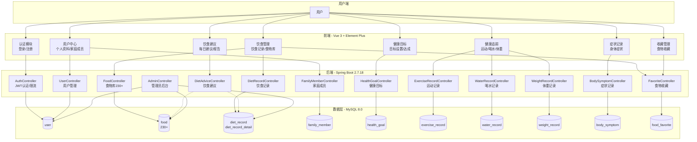

# 智能饮食健康管理平台 — 功能架构图

## 功能模块说明

| 模块 | 功能 | 后端接口 |
|------|------|----------|
| 认证 | 登录/注册/JWT/限流 | `/auth/*` |
| 用户 | 个人资料/家庭成员 | `/users/*`, `/family/*` |
| 食物 | 食物库浏览/收藏 | `/foods/*`, `/favorites/*` |
| 饮食 | 记录每餐/营养计算 | `/diet-records/*` |
| 目标 | 健康目标设置/进度 | `/health-goals/*` |
| 运动 | 运动记录 | `/exercise-records/*` |
| 喝水 | 喝水记录 | `/water-records/*` |
| 体重 | 体重记录/趋势 | `/weight-records/*` |
| 症状 | 身体症状记录 | `/body-symptoms/*` |
| 建议 | 智能饮食建议 | `/diet-advice/*` |
| 管理 | 后台管理 | `/admin/**` |
